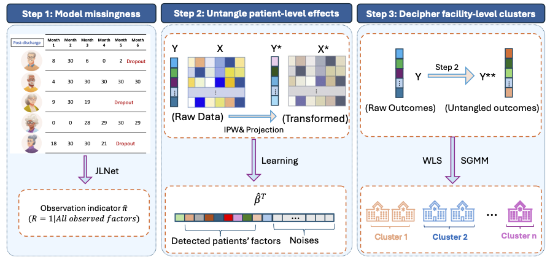

# JLNet: A Joint Learning for Analyzing a National Geriatric Centralized Networks



**Background**: Centralized networks such as Medicare administrative claim data can directly pool deidentified patient-centered data across centers/institutions and store them in centralized data warehouses. A growing number of studies use Medicare claims data to conduct patient-centered research and inform personalized care for older adults. However, traditional methods are not capable of addressing challenges inherent to the complex hierarchical data structure,  including absent or inadequate integration of hospital-level data, non-normal outcome distributions, informative patient dropout (due to insurance changes, mortality, etc.), and high computational load when analyzing large-scale datasets. A new method is needed to handle these challenges and support valid inference and interpretability.

**JLNet** is a novel analytical framework integrating multiple statistical and machine learning techniques, including propensity score weighting, projection methods, regularized regression, and unsupervised learning. It offers several unique features not available in existing toolkits, including the flexible identification of high-dimensional patient-level factors associated with care outcomes (potentially with time-varying effects), the computationally efficient detection of latent hospital clusters, and the ability to handle real-world data complexities, such as patient dropout and non-normally distributed outcomes. 

# Installation

``` r
if (!require("devtools")) {
  install.packages("devtools")
}
devtools::install_github("yilinzhang066/JLNet")
```
